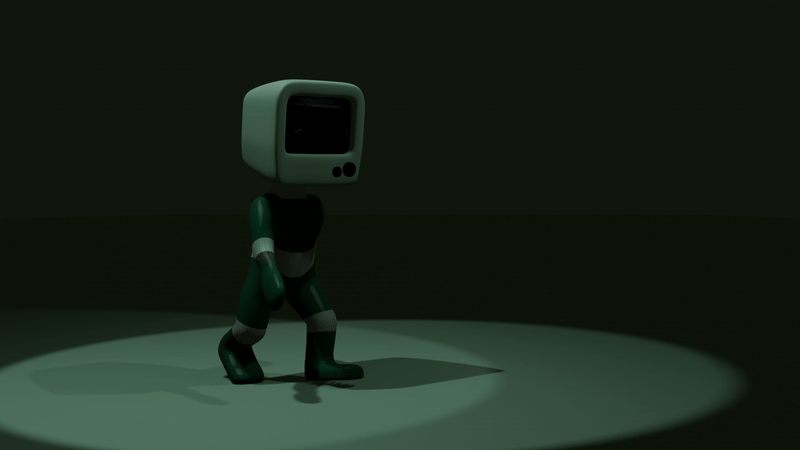

# 🖥️ Bob-The-TV

A stylized 3D character built with Blender and brought to life in React Three Fiber. Includes model and animation assets.  


<p align="center">
  
  
  
  
</p>


---

## 🚀 Live Demo

[Say hello to bob 📺](https://bob-the-tv-lihd.vercel.app/)

---

## 🧱 Features

- ✅ Animated walk cycle imported from Blender
- ✅ Real-time **video-texture screen** (supports `.mp4` / `.webm`)
- ✅ Shadow-casting and override system for Blender-exported lights
- ✅ React Three Fiber + Drei setup with modular component structure

---

## 🛠️ Installation

```bash
git clone https://github.com/aminhsnzadeh/bob-the-tv.git
cd bob-the-tv
pnpm install
# or: npm install / yarn
```
After installation just run :
```bash
pnpm dev
# or npm dev
```

You can change TV content by replaceing the video here :

```
📁 public/
├── models/
│   └── tv-man.glb
└── textures/
    └── glitch.mp4 
```

Note that you should name your video to glitch with format mp4

---

## 📦 Tech Stack

- React
- React Three Fiber (R3F)
- Drei
- Threejs
- Blender (modeling and animation)
- Vite
- Typescript

---

## ⚒️ 3D Asset Creation (Blender)

Bob the TV was modeled, rigged, and animated entirely in [Blender](https://blender.org/).

- Base mesh created using subdivision modeling and small Topology for joints
- Rigged using Blender’s Armature system and used IK rigging for walk cycle
- Walk cycle animated and exported as `.glb` with baked keyframes
- Custom materials applied, including a screen shader that was later replaced with a video texture in Three.js

> 💡 Blender lights and cameras were used for layout reference, but overridden in Three.js for dynamic lighting and shadows

Final render from blender :

<p align="center">
  
</p>

🎬 [Click to view full render video](./public/render-file/final.mp4)

---

## 🔮 Future ideas

- Creating a system to change TV screen with remote control
- More dynamic animations and controllable using special buttons
- Dev mode and rig editting
- Customizable material and scene
- A friend for bob (maybe more ! enough to attend a party)

## 🤝 Contribution

Contributions, ideas, and PRs are welcome!
If you make a modded version of Bob (cyberpunk? old CRT? horror style?), let me know!

Open an issue or fork the repo to get started.

---

## 🙋‍♂️ Author

<b> Amin - </b> Frontend developer (JS/React)

Contact via GitHub or LinkedIn.

Feel free to reach me and discuss with me about different subjects ;) 💙
